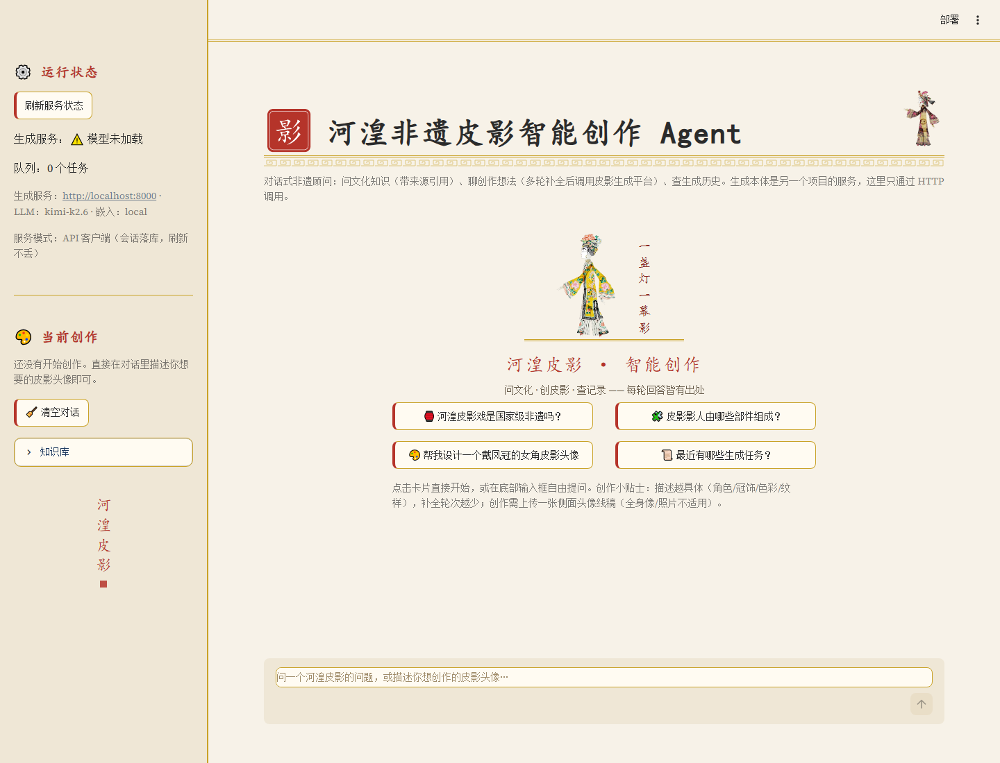

# 河湟非遗皮影智能创作 Agent | Hehuang Heritage Agent

面向非遗数字化场景的知识问答与皮影创作引导智能体。项目用 LangGraph 编排意图识别、证据检索、多轮信息收集和工具调用，并通过 HTTP 连接独立的图像生成服务。


[功能](#功能) · [界面](#界面) · [架构](#架构) · [快速开始](#快速开始) · [安全边界](#安全边界)

## 功能

- 多意图对话：文化问答、创作引导、历史查询和闲聊自动路由
- 有据问答：从自写事实摘要卡检索依据并附来源；证据不足时明确说明
- 多轮创作：从自然语言中收集角色、朝向、冠饰、色彩和纹样等信息，缺少信息时继续询问
- 生成联动：通过 HTTP 调用下游皮影图像服务，提交任务、轮询状态并展示候选结果
- 会话管理：保存会话、消息和任务历史，支持刷新页面后继续查看
- 流式交互：FastAPI 提供服务接口，Streamlit 提供可直接操作的演示界面

## 界面

<p align="center">
  
</p>

截图中的下游生成服务可能处于未启动状态；Agent 问答、检索和会话功能可以独立运行。完整创作流程需要同时启动外部图像服务。

## 架构

```text
User
  ↓
Streamlit UI (8501)
  ↓
FastAPI Agent API (8001)
  ↓
LangGraph state graph
  ├── intent router
  ├── evidence-bounded RAG over ChromaDB
  ├── creation slot collector
  ├── session / message storage in SQLite
  └── image-service tool
          ↓ HTTP only
External image-generation service (8000)
```

本仓库负责对话、检索、会话和服务调用；图像服务负责图像生成、任务队列、候选管理及历史结果。两者通过接口解耦，仓库不包含下游服务的模型实现、权重或私有预处理。

## 快速开始

### 1. 创建环境

```bash
conda create -n hehuang_agent python=3.11 -y
conda activate hehuang_agent
pip install -r requirements.txt
```

### 2. 配置服务

请在 shell 中设置环境变量。`.env.example` 只提供配置示例，不包含真实密钥。

```powershell
# Windows PowerShell
$env:LLM_BASE_URL="https://api.moonshot.cn/v1"
$env:LLM_API_KEY="sk-..."
$env:LLM_MODEL="kimi-k2.6"
$env:EMBEDDING_PROVIDER="local"
$env:LOCAL_EMBEDDING_MODEL="./models/bge-small-zh-v1.5"
$env:PUPPET_API_BASE="http://localhost:8000"
```

### 3. 建立检索索引

首次运行或更新 `data_sources/` 后执行：

```bash
python -m agent_project.retrieval.ingest --reset
```

### 4. 启动服务

```bash
python -m uvicorn agent_project.api.server:app --host 127.0.0.1 --port 8001
streamlit run app.py --server.port 8501
```

访问：

- Streamlit UI: <http://localhost:8501>
- Agent API docs: <http://localhost:8001/docs>
- Agent health: <http://localhost:8001/api/health>

Windows 用户也可以复制 `启动Agent双服务.example.bat` 为本机启动脚本，再在本机脚本中填写私有环境变量。实际启动脚本已被 `.gitignore` 忽略。

## 外部服务接口

外部图像服务地址由 `PUPPET_API_BASE` 配置。Agent 使用以下产品级接口：

- `POST /api/generate`：提交生成任务
- `GET /api/tasks/{task_id}`：查询任务状态和结果
- `GET /api/history`：查询历史任务
- `GET /api/health`：查询服务状态

线稿上传支持 PNG、JPEG、WEBP 和 BMP，单文件大小由客户端限制。Agent 只保存运行时上传文件，不把用户素材提交到 Git。

## 本地测试

```bash
python -m pytest tests -q
```

测试覆盖工具调用、知识检索、图编排、会话流程和 API 回归。评测数据与运行报告仅用于本地开发验证，不作为公开项目说明的一部分。

## 目录结构

```text
hehuang-shadow-puppet-agent/
├── app.py                  # Streamlit UI
├── agent_project/
│   ├── api/                # FastAPI service layer
│   ├── graph/              # LangGraph state / nodes / builder
│   ├── retrieval/          # embeddings / Chroma store / ingest
│   ├── schemas/            # creation slots and prompt assembly
│   └── tools/              # retrieval and image-service tools
├── data_sources/           # 自写事实摘要卡与公开服务说明
├── eval/                   # 本地开发评测脚本与数据
├── tests/                  # mock 回归测试
├── docs/screenshots/       # GitHub 展示截图
├── .env.example            # 环境变量示例
└── 启动Agent双服务.example.bat
```

## 安全边界

- 不要提交真实 `LLM_API_KEY`、`.env`、运行时数据库、模型文件或本机启动脚本。
- 下游图像模型、权重、训练数据、私有预处理和服务端评分逻辑不在本仓库中。
- 公开的 `data_sources/` 只保存自写摘要和来源元数据，不保存外部网页全文、图片、视频或音频。
- 若密钥误提交到远端，应立即在服务商后台吊销并重新生成。
